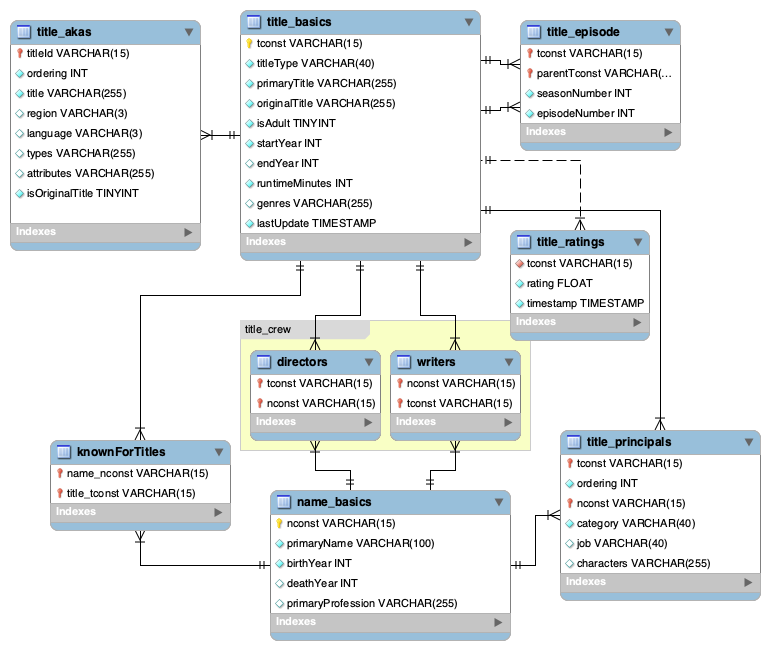

<!-- markdownlint-disable MD033 -->

# ETL proces pre databázu filmov (IMDb)

## Popis projektu

Môj projekt sa zameriava na spracovanie [IMDb datasetu](https://developer.imdb.com/non-commercial-datasets/) pomocou ETL procesu v rámci hviezdicovej schémy na platforme [Snowflake](https://www.snowflake.com/).

## Zdrojový dataset

Zdrojový dataset pozostáva z TSV (tab-separated-values) súborov, ktoré sú skomprimované algoritmom Gzip. Entitno-relačný diagram datasetu s vizualizáciou vzťahov vyzerá nasledovne:

<b>Obrázok 1:</b> ERD diagram surových dát

## Odkazy

- [GitHub repozitár](https://github.com/SKevo18/imdb_projekt_dt_2024)
- [Zdrojové datasety](https://datasets.imdbws.com/)

**Autor projektu:** Kevin Svitač, FPVaI UKF 2024
