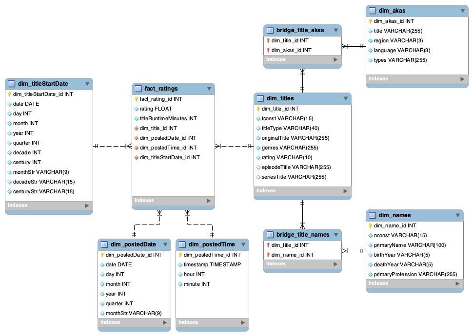

<!-- markdownlint-disable MD033 -->

# Spracovanie a analýza databázy filmov IMDb

## Popis projektu

Môj projekt sa zameriava na spracovanie oficiálneho [IMDb datasetu](https://developer.imdb.com/non-commercial-datasets/) pomocou ETL procesu v rámci hviezdicovej schémy na platforme [Snowflake](https://www.snowflake.com/).

## Zdrojový dataset

Platforma IMDb poskytuje časť svojich dát prostredníctvom datasetov pre verejnosť alebo akademické účely. Tieto dáta sa denne aktualizujú a najnovšia verzia je dostupná k stiahnutiu [**tu**](https://datasets.imdbws.com/).

V rámci môjho projektu analyzujem verziu datasetu k **6. decembru 2024** (veľkosť: ~1.6 GB).

Tento dataset som sa rozhodol použiť z dvoch hlavných dôvodov:

1. Dataset obsahuje skutočné údaje o hodnoteniach jednotlivých filmov a seriálov, tak ako by sme ich videli na oficiálnej stránke IMDb. Chcem získať praktické zručnosti v oblasti spracovania dát a zamerať sa na analýzu skutočných dát, preto som sa rozhodol použiť tento dataset namiesto plne generovaných dát alebo menších datasetov;
2. Dataset je dostatočne veľký a umožňuje vykonávať veľké množstvo užitočných analýz;

Avšak, napriek tomu mal tento dataset niekoľko nevýhod - hlavnou bola absencia údajov v čase. Rozhodol som sa preto pouźiť jazyk Python pre vygenerovanie a doplnenie niektorých kľúčových údajov pre simulovanie plnohodnotnej analýzy. Všetky skripty ktoré som použil sú dostupné v priečinku [`./py`](./py/):

- [`py/ratings.py`](./py/ratings.py) - upraví dataset `title.ratings.tsv.gz` tak, aby každý titul obsahoval 5 až 10 náhodných hodnotení s náhodnou časovou pečiatkou medzi rokom 2004 a aktuálnym rokom (2024). Keďže som chcel zachovať vierohodnosť dát, naprogramoval som skript tak aby generoval náhodné hodnotenia ktorých aritmetický priemer sa zhoduje s pôvodným priemerom hodnotenia daného titulu - to znamená, že ak hodnotenia daného titulu spriemerujem po vygenerovaní náhodných hodnotení, dostanem priemer ktorý sa zhoduje s pôvodným údajom na stránke IMDb;
- [`py/titles.py`](./py/titles.py) - pridá do datasetu `title.basics.tsv.gz` nový stĺpec `lastUpdate` ktorý simuluje čas poslednej aktualizácie daného titulu v IMDb databáze. Tento skript taktiež upraví stĺpce `startYear` a `endYear` na náhodné dátumy, namiesto iba čísla roku vydania. Opäť, aby dáta vyzerali realisticky, naprogramoval som skript tak aby rešpektoval dátum vydania titulu (napr.: titul nemôže byť upravený pred jeho vydaním, a podobne).

### Entitno-relačný diagram

**Entitno-relačný diagram datasetu** s vizualizáciou vzťahov naprieč všetkými súbormi v datasete by v tradičnej entitno-relačnej schéme vyzeral nasledovne:

<div align="center">

<p><b>Obrázok 1:</b> <a href="ostatne/original_erd.mwb">ERD diagram</a> surových dát</p>
</div>

### Všeobecné vlastnosti datasetu

- Každý TSV súbor je v komprimovanom formáte (gzip);
- Oddelovače hodnôt predstavujú tabulátory - `\t`;
- Kódovanie textu je UTF-8;
- Prvý riadok každého súboru obsahuje hlavičku so zoznamom stĺpcov;
- Hodnota `\N` predstavuje chýbajúcu alebo neznámu hodnotu (`NULL`);
- Polia (napr.: `types`, `attributes`) môžu obsahovať jeden alebo viac reťazcov, ktoré sú oddelené čiarkou;

#### Súbory a ich význam

- `title.akas.tsv.gz` (50 miliónov záznamov, 438 MB): obsahuje záznamy o alternatívnych, medzinárodných a lokálnych názvoch titulov, keďže názvy filmov sú obvykle prekladané do viacerých jazykov - AKAs (*Also-Known-As*);
- `title.basics.tsv.gz` (11 miliónov záznamov, 300 MB): obsahuje základné informácie o každom titule v datasete (titul môže predstavovať napr.: jeden film alebo seriál);
- `title.crew.tsv.gz` (10 miliónov záznamov, 73 MB): informácie o filmových a televíznych tvorcoch, konkrétne o režiséroch (`directors`) a scenáristoch (`writers`);
- `title.episode.tsv.gz` (8 miliónov záznamov, 47 MB): týka sa epizód seriálov; prepája epizódy (tituly) so seriálom, ktorého sú súčasťou (t. j. s nadradeným titulom);
- `title.principals.tsv.gz` (90 miliónov záznamov, 693 MB): informácie o hlavných osobách spojených s titulom (herci, režiséri, kameramani, atď.), pričom uvádza ich roly alebo postavy, ktoré hrali;
- `title.ratings.tsv.gz` (4 milióny záznamov, 44 MB): obsahuje hodnotenia titulov na základe hlasovania používateľov IMDb;
- `name.basics.tsv.gz` (14 miliónov záznamov, 276 MB): opisuje jednotlivé osoby (hercov, režisérov, scenáristov, atď.) v databáze;

> [!NOTE]
> Dôvodom, prečo je veľkosť `title.crew.tsv.gz`  oveľa menšia ako napríklad `title.basics.tsv.gz` napriek porovnateľnému počtu záznamov je ten, že súbor `title.crew.tsv.gz` obsahuje oveľa menej stĺpcov s údajmi.

## Staging

Od tejto časti budem popisovať konkrétne kroky ktoré som vykonal pre spracovanie datasetu v Snowflake. V prvom rade som vytvoril novú databázu a dátový sklad pomocou nasledovných dotazov:

```sql
CREATE DATABASE IF NOT EXISTS HEDGEHOG_IMDB;
USE DATABASE HEDGEHOG_IMDB;

CREATE WAREHOUSE IF NOT EXISTS HEDGEHOG_IMDB_WH;
USE WAREHOUSE HEDGEHOG_IMDB_WH;
```

Nasledoval príkaz pre vytvorenie `staging` schémy:

```sql
CREATE SCHEMA IF NOT EXISTS HEDGEHOG_IMDB.staging;
```

Priečinok [`./extract`](./extract/) obsahuje 2 Bash skripty ktoré som vytvoril pre automatizáciu a zrýchlenie celého procesu získavania TSV datasetov zo stránky IMDb:

1. [`stiahnut.sh`](./extract/stiahnut.sh) - stiahne všetky datasety zo stránky [datasets.imdbws.com](https://datasets.imdbws.com/);
2. [`nahrat.sh`](./extract/nahrat.sh) - spustí SQL súbor [`nahrat.sql`](./extract/nahrat.sql), ktorý nahrá stiahnuté súbory do mojej Snowflake staging arény pomocou príkazu `PUT` v [SnowSQL](https://docs.snowflake.com/en/user-guide/snowsql) na server Snowflake.

Hlavný dôvod prečo som použil SnowSQL rozhranie je ten, že štandardné webové rozhranie Snowflake nepodporuje nahrávanie súborov väčších ako 250 MB - v taktom prípade je potrebné použiť práve príkaz `PUT`, ktorý povoľuje nahrávanie oveľa väčších súborov.

Avšak, najskôr je potrebné vytvoriť stage, do ktorej nahrám potrebné súbory:

```sql
CREATE STAGE IF NOT EXISTS HEDGEHOG_IMDB.STAGING.IMDB_STAGE;
```

Počas tohto kroku som hneď vytvoril aj formát, ktorý popisuje moje TSV súbory. Teda:

- súbory obsahujú jeden riadok ktorý predstavuje hlavičku;
- hodnoty sú oddelené tabulátorom (čo predstavuje znak `\t`);
- jednotlivé záznamy sú oddelené novým riadkom (`\n`).

Argument `NULL_IF` v dotaze nižšie hovorí, že ak Snowflake pri spracovaní údajov narazí na pole s hodnotou `\N`, prekonvertuje to automaticky na pole s hodnotou `NULL`. Parameter `ERROR_ON_COLUMN_COUNT_MISMATCH` je užitočný, pokiaľ by údaje z nejakého dôvodu nemali konzistentný počet stĺpcov.

Výsledný dotaz pre tvorbu takéhoto formátu je nasledovný:

```sql
CREATE OR REPLACE FILE FORMAT TSV_FORMAT
    TYPE = 'CSV'
    SKIP_HEADER = 1
    FIELD_DELIMITER = '\t' RECORD_DELIMITER = '\n'
    NULL_IF = ('\\N')
    ERROR_ON_COLUMN_COUNT_MISMATCH = TRUE;
```

Dáta sa v surovej podobe musia nahrať do staging arény vyhradenej pre dátový sklad môjho projektu (pomocou skriptu [`extract/nahrat.sh`](./extract/nahrat.sh)). Úspešnosť tohto kroku môžem následne overiť týmto SQL dotazom (alebo budem jednoducho sledovať výstup v termináli, ktorý bude generovať príkaz `PUT` potom, ako sa súbor nahrá na AWS server Snowflake):

```sql
-- extract/nahrat.sh
LIST @HEDGEHOG_IMDB.STAGING.IMDB_STAGE/;
/*
name                                size        md5                                 last_modified
imdb_stage/title.principals.tsv.gz  693215888   46c6714c64061f82db048802cc754c87-83 Fri, 6 Dec 2024 18:41:11 GMT
imdb_stage/title.akas.tsv.gz        438905200   ff6b9daa81caf8618cd45581e8624e22-53 Fri, 6 Dec 2024 18:08:54 GMT
imdb_stage/name.basics.tsv.gz       276461856   72c1ac5d83f400ed350e58d7e4136872-33 Fri, 6 Dec 2024 19:08:53 GMT
imdb_stage/title.basics.tsv.gz      198383712   9c73dce33351e5499f8d8d220a1028d0    Fri, 6 Dec 2024 18:26:55 GMT
imdb_stage/title.crew.tsv.gz        73586400    4bbc9168a71b7e8a70c41731089dc216    Fri, 6 Dec 2024 18:35:54 GMT
imdb_stage/title.episode.tsv.gz     47741904    614030ad20eaef6c4bcbb9a11b4a5125    Fri, 6 Dec 2024 18:39:24 GMT
imdb_stage/title.ratings.tsv.gz     7583120     883f2bb5e9ca543a35b4d220f8cb036c-2  Fri, 6 Dec 2024 17:45:16 GMT
*/
```

Pripravím si tabuľky, do ktorých budem kopírovať. Napr. toto je príkaz `CREATE TABLE` pre tabuľku `title_basics`:

```sql
CREATE OR REPLACE TABLE staging.title_basics (
    tconst VARCHAR(15) PRIMARY KEY,
    titleType VARCHAR(40),
    primaryTitle VARCHAR(255),
    originalTitle VARCHAR(255),
    isAdult BOOLEAN,
    startYear INTEGER,
    endYear INTEGER,
    runtimeMinutes INTEGER,
    genres VARCHAR(255)
);
```

V tomto bode používam `CREATE OR REPLACE`, pretože ak import zlyhá a v tabuľke zostanú z nejakého dôvodou údaje, nechcem tam mať duplicity pri opakovanom importe. Tento príkaz spôsobí to, že pri opätovnom spustení sa predošlá tabuľka nahradí (to jest, vymaže a znovu vytvorí nanovo).

Následne sa skopírujú do staging tabuliek, napr. pre tabuľku `title_basics` vyzerá príkaz `COPY INTO` nasledovne:

```sql
COPY INTO HEDGEHOG_IMDB.STAGING.title_basics
FROM @HEDGEHOG_IMDB.STAGING.IMDB_STAGE/title.basics.tsv.gz
FILE_FORMAT = TSV_FORMAT
ON_ERROR = 'CONTINUE';
/*
file                             status           rows_parsed rows_loaded error_limit errors_seen first_error                                                  first_error_line  first_error_character   first_error_column_name
imdb_stage/title.basics.tsv.gz  PARTIALLY_LOADED 11286007    11285932    11286007    75          User character length limit (255) exceeded by string '... ' 2613256          18                     "TITLE_BASICS"["PRIMARYTITLE":3]
*/
```

Z výstupu vyššie môžem vidieť, že sa úspešne načítalo približne 11 miliónov záznamov, ale vyskytlo sa aj 75 chýb pri konverzii údajov na formu ktorá zodpovedá schéme mojej Snowflake staging tabuľky.

Vyriešil som to príkazom `ON_ERROR = 'CONTINUE'`, čím zabezpečím to, že Snowflake bude v importovaní pokračovať aj vtedy, ak narazí na chybu. Napríklad, vyššie uvedený výstup hovorí, že prvý riadok kde sa vyskytla chyba obsahoval pole, ktorého dĺžka presahovala veľkosť 255 (čo v mojej tabuľke predstavuje stĺpec s `VARCHAR(255)`).
Pomer takto "chybných" záznamov voči celkovému počtu je zanedbateľný a neskreslí moju analýzu žiadnym výrazným spôsobom - z tohto dôvodu tieto hodnoty nebudem opravovať, iba ich import jednoducho preskočím.

Keďže predvolená možnosť pre parameter `COMPRESSION` v mojom `TSV_FORMAT` formáte je `'AUTO'`, Snowflake automaticky rozpozná že sa jedná o gzip súbory ktoré musí pred skopírovaním do tabulky dekomprimovať. Teda, nemusím nahrávať vopred dekomprimované dáta ktoré by zaberali oveľa viacej úložného priestoru a nahrávali by sa dlhšie.

## Hviezdicová schéma

Pôvodný dátový model v podobe surových TSV dát som transformoval na hviezdicovú schému, ktorá je znázornená nižšie:

<div align="center">

<p><b>Obrázok 2:</b> <a href="ostatne/star_schema.mwb">ERD diagram</a> hviezdicovej schémy</p>
</div>

- `fact_ratings` - jedná sa o moju tabuľku faktov, obsahuje informácie o hodnoteniach jednotlivých titulov, teda hlavnú tabuľku ktorú budem skúmať:
  - `rating` - desatinné číslo od `0` do `10` ktoré predstavuje hodnotenie titulu od používateľa;
  - `titleRuntimeMinutes` - celé číslo ktoré predstavuje dĺžku titulu v minútach;
  - **SCD typ:** `SCD Type 1`;
- `dim_date`, `dim_time` - tabuľka dimenzií, ktorá obsahuje informácie o dátume a čase, kedy sa hodnotenie používateľa zaznamenalo alebo kedy sa vydal nejaký titul;
  - **SCD typ:** `SCD Type 0`;
- `dim_titles` - tabuľka dimenzií, ktorá obsahuje dodatočné informácie o hodnotených tituloch, ktoré sa v datasete nachádzajú:
  - `tconst` - originálny identifikátor titulu;
  - `titleType` - typ titulu (film, seriál, atď.);
  - `originalTitle` - originálny názov titulu;
  - `genres` - žánre titulu;
  - `rating` - ohodnotenie filmu (či je `PG` alebo `18+`);
  - `episodeTitle` - názov epizódy seriálu (`NULL` ak sa nejedná o seriál);
  - `seriesTitle` - názov seriálu z ktorého epizóda pochádza (`NULL` ak sa nejedná o seriál);
  - **SCD typ:** `SCD Type 1`;
- `dim_names` - informácie o menách hercov, režisérov, scenáristov, atď., súvisia s hodnotenými titulami:
  - `nconst` - originálny identifikátor osoby;
  - `primaryName` - názov osoby;
  - `birthYear` - rok narodenia osoby;
  - `deathYear` - rok úmrtia osoby;
  - `primaryProfession` - hlavné povolanie/funkcia;
  - **SCD typ:** `SCD Type 1`;
- `dim_title_names` - prepojenie vzťahom `M:N` medzi tabuľkami `dim_titles` a `dim_names`;
- `dim_akas` - informácie o alternatívnych, medzinárodných a lokálnych názvoch titulov, keďže názvy filmov sú obvykle prekladané do viacerých jazykov - užitočné, ak chcem analyzovať hodnotenia titulov podľa rôznych krajín:
  - `titleId` - originálny identifikátor titulu (`tconst`);
  - `title` - názov titulu v danej krajine;
  - `region` - kód krajiny;
  - `language` - jazyk;
  - `types` - atribúty pre konkrétny titul (napr. `dvd`, a podobne);
  - **SCD typ:** `SCD Type 1`;

### Načítanie údajov do hviezdicovej schémy

Vytvorím si schému pre moju tabuľku faktov a dimenzie:

```sql
CREATE SCHEMA IF NOT EXISTS HEDGEHOG_IMDB.star;
USE SCHEMA HEDGEHOG_IMDB.star;
```

Následne importujem zo `staging` do `star` schémy dimenzie času, napr.: pre dimenziu `dim_postedDate` je to nasledovný dotaz:

```sql
CREATE OR REPLACE TABLE dim_postedDate AS
SELECT DISTINCT
    ROW_NUMBER() OVER (ORDER BY date) AS dim_postedDate_id, -- ID pre každý záznam, zoradené podľa dátumu
    date,
    EXTRACT(DAY FROM date) AS day, -- deň
    EXTRACT(MONTH FROM date) AS month, -- mesiac
    EXTRACT(YEAR FROM date) AS year, -- rok
    EXTRACT(QUARTER FROM date) AS quarter, -- kvartál/štvrťrok
    TO_CHAR(date, 'Mon') AS monthStr, -- skratka mesiaca
FROM (
    SELECT DISTINCT TO_DATE(timestamp) AS date FROM staging.title_ratings -- konverzia časového údaju na dátum vykonám v poddotaze, aby som mohol podľa toho zoradiť výsledky a vytvoriť jedinečné ID hodnoty
);
```

Podobným spôsobom importujem aj časové údaje o tom, kedy sa hodnotenia zverejnili:

```sql
CREATE OR REPLACE TABLE dim_postedTime AS
SELECT DISTINCT
    ROW_NUMBER() OVER (ORDER BY time) AS dim_postedTime_id,
    time,
    EXTRACT(HOUR FROM time) AS hour,
    EXTRACT(MINUTE FROM time) AS minute
FROM (
    SELECT DISTINCT TO_TIME(timestamp) AS time FROM staging.title_ratings
);
```

Pre schému dimenzie `dim_titleStartDate` som zvolil detailnejšie informácie o dátume vydania titulu, keďže niektoré informácie o tituloch siahajú niekoľko desaťročí do minulosti, preto sa môžu hodiť pre detailnejšiu analýzu faktovej tabuľky:

```sql
CREATE OR REPLACE TABLE dim_titleStartDate AS
SELECT DISTINCT
    ROW_NUMBER() OVER (ORDER BY date) AS dim_titleStartDate_id,
    date,
    EXTRACT(DAY FROM date) AS day,
    EXTRACT(MONTH FROM date) AS month,
    EXTRACT(YEAR FROM date) AS year,
    EXTRACT(QUARTER FROM date) AS quarter,
    FLOOR(EXTRACT(YEAR FROM date) / 10) * 10 % 100 AS decade,
    FLOOR(EXTRACT(YEAR FROM date) / 100) + 1 AS century,
    TO_CHAR(date, 'Mon') AS monthStr,
    CONCAT(FLOOR(EXTRACT(YEAR FROM date) / 10) * 10 % 100, 's') AS decadeStr,
    CONCAT(FLOOR(EXTRACT(YEAR FROM date) / 100) + 1, '. century') AS centuryStr
FROM (
    SELECT DISTINCT startDate AS date FROM staging.title_basics
);
```

Atribút `endDate` som sa rozhodol neimportovať do samostatnej dimenzie, nakoľko by schéma bola zbytočne komplexnejšia a menej prehľadná, a v mojich dashboardoch informáciu o skončení určitého seriálu ani nevyužijem.

Počas tvorby dimenzie `dim_titles` importujem iba tie tituly, ktoré sú buď filmy alebo seriály (pretože v datasete sa nachádzajú aj rôzne krátke tituly alebo trailere a podobne). Zároveň ma zaujímajú aj informácie o konkrétnej epizóde, iba pokiaľ o nej existuje záznam v datasete, a táto epizóda patrí do určitého seriálu (sem-tam sa môže vyskytnúť aj situácia, že epizódy nemajú seriál do ktorého patria - takéto záznamy nebudem brať do úvahy).

Tituly importujem pomocou dotazu:

```sql
CREATE OR REPLACE TABLE dim_titles AS
SELECT DISTINCT
    ROW_NUMBER() OVER (ORDER BY tb.tconst) AS dim_title_id,
    tb.tconst,
    tb.titleType,
    tb.originalTitle,
    tb.genres,
    CASE
        WHEN tb.isAdult THEN '18+'
        ELSE 'PG'
    END AS rating, -- ohodnotenie filmu (t. j. či je `PG` alebo `18+` - v podstate, konverzia BOOLEAN na VARCHAR)
    CASE 
        WHEN te.tconst IS NOT NULL THEN 'S' || te.seasonNumber || 'E' || te.episodeNumber
        ELSE NULL
    END AS episodeTitle, -- názov epizódy seriálu (`NULL` ak sa nejedná o seriál, t. j. nemáme JOIN pre epizódu)
    CASE 
        WHEN te.tconst IS NOT NULL THEN parent_tb.originalTitle
        ELSE NULL
    END AS seriesTitle -- názov seriálu z ktorého epizóda pochádza (opäť `NULL` ak sa nejedná o seriál)
FROM staging.title_basics tb
LEFT JOIN staging.title_episode te ON te.tconst = tb.tconst -- LEFT JOIN pre epizódu seriálu - nie každý titul patrí do seriálu
LEFT JOIN staging.title_basics parent_tb ON parent_tb.tconst = te.parentTconst -- LEFT JOIN pre seriál
WHERE tb.titleType
    IN ('movie', 'tvSeries') OR -- len filmy a seriály
    (tb.titleType = 'tvEpisode' AND te.tconst IS NOT NULL); -- alebo epizódy seriálov, ak existuje v tabuľke `title_episode`
```

Následne importujem mená (hercov, režisérov, a podobne):

```sql
CREATE OR REPLACE TABLE dim_names AS
SELECT DISTINCT
    ROW_NUMBER() OVER (ORDER BY nconst) AS dim_name_id,
    nconst,
    primaryName,
    CAST(birthYear AS VARCHAR(5)) AS birthYear,
    CAST(deathYear AS VARCHAR(5)) AS deathYear,
    primaryProfession
FROM staging.name_basics;
```

...a spojovaciu tabuľku pre mená a tituly:

```sql
CREATE OR REPLACE TABLE dim_title_names AS
SELECT DISTINCT
    -- spojenie cez ID, nie cez originálne konštanty
    dn.dim_name_id,
    dt.dim_title_id
FROM (
    SELECT nb.nconst, TRIM(title.value) AS tconst -- `title.value` predstavuje `tconst`, ktorý očistím od prípadných bielych znakov
    FROM staging.name_basics nb, -- `knownForTitles` je pole typu `VARCHAR`, ale obsahuje `tconst` oddelené čiarkami
         LATERAL FLATTEN(INPUT => SPLIT(nb.knownForTitles, ',')) title -- oddelí `knownForTitles` na jednotlivé tituly podľa čiarky, do "podtabuľky" `title` - to znamená, že bude existovať viacero hodnôt `nb.nconst` ktoré budú obsahovať jednotlivé `tconst` titulov
) par -- "pár" je v tomto prípade dvojica `nconst` a `tconst`
JOIN dim_names dn ON dn.nconst = par.nconst
JOIN dim_titles dt ON dt.tconst = par.tconst;
```

Pre dimenziu alternatívnych názvov titulov je dotaz nasledovný:

```sql
CREATE OR REPLACE TABLE dim_akas AS
SELECT DISTINCT
    ROW_NUMBER() OVER (ORDER BY titleId) AS dim_akas_id,
    titleId,
    title,
    region,
    language,
    types
FROM staging.title_akas;
```

Nakoniec, faktová tabuľka o hodnoteniach kde všetko zhrniem:

```sql
CREATE OR REPLACE TABLE fact_ratings AS
SELECT DISTINCT
    ROW_NUMBER() OVER (ORDER BY ratings.timestamp) AS fact_rating_id,
    ratings.rating,
    staging.title_basics.runtimeMinutes AS titleRuntimeMinutes,
    CASE 
        WHEN staging.title_basics.titleType = 'tvEpisode' THEN staging.title_episode.episodeNumber
        ELSE NULL
    END AS episodeNumber, -- epizóda, ak sa jedná o seriál
    CASE 
        WHEN staging.title_basics.titleType = 'tvEpisode' THEN staging.title_episode.seasonNumber
        ELSE NULL
    END AS seasonNumber, -- číslo sezóny, ak sa jedná o seriál
    dim_titles.dim_title_id, -- ID titulu
    dim_postedTime.dim_postedTime_id, -- čas zverejnenia hodnotenia
    dim_postedDate.dim_postedDate_id, -- dátum zverejnenia hodnotenia
    dim_titleStartDate.dim_titleStartDate_id, -- dátum vydania titulu
FROM staging.title_ratings AS ratings
LEFT JOIN staging.title_episode ON ratings.tconst = title_episode.tconst -- epizódy majú iba seriály, nie napr. filmy
JOIN staging.title_principals ON ratings.tconst = title_principals.tconst
JOIN staging.title_basics ON ratings.tconst = staging.title_basics.tconst
JOIN dim_titles ON ratings.tconst = dim_titles.tconst
JOIN dim_postedTime ON TO_TIME(ratings.timestamp) = dim_postedTime.time
JOIN dim_postedDate ON TO_DATE(ratings.timestamp) = dim_postedDate.date
JOIN dim_titleStartDate ON staging.title_basics.startDate = dim_titleStartDate.date
WHERE staging.title_basics.runtimeMinutes IS NOT NULL; -- pre vynechanie prípadov, kde by v datasete nebol údaj o dĺžke filmu - takéto údaje považujem za neúplné a nechcem ich v datasete zahrnúť
```

Ako poslednú vec v ELT procese iba vymažem `staging` tabuľky, ktoré už nebudem potrebovať, aby zbytočne nezaberali úložný priestor na serveri:

```sql
DROP TABLE IF EXISTS staging.title_basics;
DROP TABLE IF EXISTS staging.title_akas;
DROP TABLE IF EXISTS staging.title_crew;
DROP TABLE IF EXISTS staging.title_episode;
DROP TABLE IF EXISTS staging.title_principals;
DROP TABLE IF EXISTS staging.title_ratings;
DROP TABLE IF EXISTS staging.name_basics;
```

## Vizualizácia

Kompletná snímka dashboardu je dostupná v súbore [./obrazky/dashboard.png](./obrazky/dashboard.png) ([PDF](./ostatne/dashboard.pdf)).

### Priemerné hodnotenie všetkých titulov podľa roku vydania


Graf zobrazuje priemerné hodnotenia (zaokrúhlené na 2 desatinné miesta) všetkých titulov v databáze podľa roku vydania daného titulu. Môžeme napríklad vidieť, že začiatkom 20. storočia je divákmi hodnotených iba veľmi málo filmov a aj samotný počet filmov je oveľa menší. No ako sa približujeme k roku 2024, vidíme že počet filmov, ich hodnotení (a aj spokojnosť divákov) sa zvyšuje. Najlepšie hodnotené filmy boli filmy vydané v roku 2015 (`7.03`), najhoršie filmy sú z roku 1899 (`3.9`).

SQL dotaz pre vygenerovanie grafu:

```sql
SELECT
    ROUND(AVG(fact_ratings.rating), 2) AS "Priemerné hodnotenie",
    dim_titleStartDate.year AS "Rok vydania titulov"
FROM fact_ratings
JOIN dim_titles ON fact_ratings.dim_title_id = dim_titles.dim_title_id
JOIN dim_postedDate ON fact_ratings.dim_postedDate_id = dim_postedDate.dim_postedDate_id
JOIN dim_titleStartDate ON fact_ratings.dim_titleStartDate_id = dim_titleStartDate.dim_titleStartDate_id
WHERE "Rok vydania titulov" <= 2024
GROUP BY "Rok vydania titulov"
ORDER BY "Priemerné hodnotenie" DESC;
```

### Aktivita používateľov v priemere počas dňa


Vyššie je zobrazená priemerná aktivita používateľov počas dňa, resp. ktoré hodiny bolo v priemere zverejnených najviac hodnotení titulov. Priemer pre jednu hodinu sa počíta z počtu hodnotení zverejnených počas každej minúty v danú hodinu. Následne sa vytvorí graf z priemerov všetkých hodín. Keďže tieto časové údaje boli doplnené automatickým skriptom, nie sú presné a neodrážajú skutočný stav na oficiálnej stránke IMDb.

SQL dotaz pre vygenerovanie grafu:

```sql
SELECT dim_postedTime.hour AS "Hodina",
       ROUND(AVG(za_hodinu), 0) AS "Priemerný počet hodnotení"
FROM (
    SELECT dim_postedTime.hour, COUNT(fact_ratings.rating) AS za_hodinu
    FROM fact_ratings
    JOIN dim_postedTime ON fact_ratings.dim_postedTime_id = dim_postedTime.dim_postedTime_id
    GROUP BY dim_postedTime.hour, dim_postedTime.minute
) dim_postedTime
GROUP BY hour
ORDER BY hour;
```

### Top 50 seriálov v slovenskom znení


Pôvodný zámer bol zostaviť rebríček "Top 50-tich originálnych slovenských titulov". Bohužiaľ, v datasete sa nenachádza informácia o krajine pôvodu jednotlivých titlov. Alternatívou bolo porovnať originálny názov titulu s alternatívnym (preloženým do iného jazyka), a vybrať všetky tie tituly, kde názov v slovenčine je zhodný s originálnym názvom (teda, je predpoklad že titul je originálom v slovenčine). Avšak, aj tu vznikol problém, konkrétne s titulmi ktoré sa neprekladajú z pôvodného názvu do slovenského (napr. "Star Trek").

Napriek tomu sa mi pomocou dodatočných filtrov podarilo zostaviť rebríček, kde sa nachádzajú zväčša slovenské seriály. Môžeme napríklad vidieť, že najlepšie hodnoteným slovenským seriálom je "Za sklom" s priemerným hodnotením `7.9`. Nasledujú tituly "Milujem Slovensko" (`7.8`), "Milenky" (7.7) a "Uragán" (`7.7`). Naopak, najhoršie hodnotené slovenské seriály (z "Top 50") sú "Rodinné prípady" (`5.4`).

SQL dotaz pre vygenerovanie grafu:

```sql
SELECT
    dim_titles.originalTitle AS "Názov filmu",
    ROUND(AVG(fact_ratings.rating), 2) AS "Priemerné hodnotenie"
FROM fact_ratings
JOIN dim_titles ON fact_ratings.dim_title_id = dim_titles.dim_title_id
JOIN dim_akas ON dim_akas.fact_rating_id = fact_ratings.fact_rating_id
WHERE
    dim_titles.titleType = 'tvSeries' AND
    dim_akas.region = 'SK' AND
    dim_akas.title = dim_titles.originalTitle
GROUP BY "Názov filmu"
ORDER BY "Priemerné hodnotenie" DESC
LIMIT 50;
```

### Hodnotenie seriálov s najväčším počtom epizód


V tomto bode mojej analýzy ma zaujímalo, ktoré seriály (z celého sveta) majú najväčší počet epizód? A aby to bolo zaujímavé, zobrazil som si aj ich priemerné hodnotenie. Výsledný graf hovorí, že seriál s najväčším počtom epizód je "The Guiding Light" s `15 762` epizódami a priemerným hodnotením `7.7`. Rýchle vyhľadanie na internete potvrdzuje, že tento seriál je skutočne z jedných ktoré majú najväčší počtet epizód (jedná sa dokonca o [najdlšie bežiacu televíznu drámu v americkej histórii](https://cs.wikipedia.org/wiki/U_n%C3%A1s_ve_Springfieldu)).

SQL dotaz pre vygenerovanie grafu:

```sql
SELECT
    dim_titles.seriesTitle AS "Názov seriálu",
    MAX(fact_ratings.episodeNumber) AS "Počet epizód",
    ROUND(AVG(fact_ratings.rating), 2) AS "Priemerné hodnotenie"
FROM fact_ratings
JOIN dim_titles ON fact_ratings.dim_title_id = dim_titles.dim_title_id
WHERE fact_ratings.episodeNumber IS NOT NULL
GROUP BY "Názov seriálu"
ORDER BY "Počet epizód" DESC, "Priemerné hodnotenie" DESC
LIMIT 50;
```

### Herci hrajúci v najviac filmoch


Podobne je dosť zaujímavé analyzovať, ktorí herci hrajú v najviac tituloch. Hercom s najväčším počtom titulov je "Kyôko Yamada" (`nm0945238`) s `1490` titulmi, ktoré majú priemerné hodnotenie `6.03`.

> [!NOTE]
> Do tejto analýzy som zahrnul iba filmy, pretože seriály obsahujú veľký počet epizód kde môže hrať ten istý herec.

SQL dotaz pre vygenerovanie grafu:

```sql
SELECT
    dim_names.nconst AS "nconst",
    dim_names.primaryName AS "Meno",
    ROUND(AVG(fact_ratings.rating), 2) AS "Priemerné hodnotenie titulov",
    COUNT(dim_titles.dim_title_id) AS "Počet titulov"
FROM fact_ratings
JOIN dim_titles ON fact_ratings.dim_title_id = dim_titles.dim_title_id
JOIN dim_title_names ON dim_titles.dim_title_id = dim_title_names.dim_title_id
JOIN dim_names ON dim_title_names.dim_name_id = dim_names.dim_name_id
WHERE
    dim_titles.titleType = 'movie' AND
    dim_names.primaryProfession IN ('actor', 'actress')
GROUP BY "nconst", "Meno"
ORDER BY "Počet titulov" DESC
LIMIT 10;
```

### Najdlhší film (v minútach) + porovnanie oproti priemernej dĺžke všetkých


Do tretice, aký je film s najväčšou dĺžkou? Podľa karty vyššie je to film s názvom "100" a dĺžkou `59 460` minút (jedná sa o najdlhší film evidovaný v [IMDb](https://www.imdb.com/title/tt29302558/) a [trailer](https://www.youtube.com/watch?v=1yIE3tyuPz4) má 1 hodinu a 16 minút. Priemerná dĺžka všetkých titulov je `5758.27` minút, čo znamená že tento titul je o `933 %` dlhší ako priemerný titul v databáze. Je to amatérsky film bez zápletky, vytvorený iba za účelom toho aby bol najdlhší v IMDb a nič iné).

SQL dotaz pre vygenerovanie grafu:

```sql
SELECT
    dim_titles.originalTitle AS "Názov",
    AVG(fact_ratings.titleRuntimeMinutes) AS "Priemerná dĺžka všetkých",
    MAX(fact_ratings.titleRuntimeMinutes) AS "Dĺžka v minútach",
FROM fact_ratings
JOIN dim_titles ON fact_ratings.dim_title_id = dim_titles.dim_title_id
WHERE dim_titles.titleType = 'movie'
GROUP BY "Názov"
ORDER BY "Dĺžka v minútach" DESC
LIMIT 1;
```

### Režiséri s najlepším priemerným hodnotením filmov a počet hlasov


Graf zobrazuje režisérov filmov, ktorý majú najväčší počet hlasov a zároveň majú ich filmy najlepšie hodnotenie. Víťazom v tomto rebríčku je režisér "Manpreet Singh" s počtom hlasov `5 030` a priemerným hodnotením `6.55`. 

SQL dotaz pre vygenerovanie grafu:

```sql
SELECT
    dim_names.primaryName AS "Meno režiséra",
    ROUND(AVG(fact_ratings.rating), 2) AS "Priemerné hodnotenie",
    COUNT(fact_ratings.rating) AS "Celkový počet hlasov" FROM fact_ratings
JOIN dim_titles ON fact_ratings.dim_title_id = dim_titles.dim_title_id
JOIN dim_title_names ON dim_titles.dim_title_id = dim_title_names.dim_title_id
JOIN dim_names ON dim_title_names.dim_name_id = dim_names.dim_name_id
WHERE
    dim_names.primaryProfession LIKE '%director%' AND
    dim_titles.titleType = 'movie'
GROUP BY "Meno režiséra"
ORDER BY "Celkový počet hlasov" DESC, "Priemerné hodnotenie" DESC
LIMIT 10;
```

## Odkazy

- [GitHub repozitár](https://github.com/SKevo18/imdb_projekt_dt_2024)
- [Zdrojové datasety](https://datasets.imdbws.com/)
- [Snowflake](https://www.snowflake.com/)
- ER diagramy boli vytvorené v programe [MySQLWorkbench](https://www.mysql.com/products/workbench/)

**Autor projektu:** Kevin Svitač, FPVaI UKF 2024
