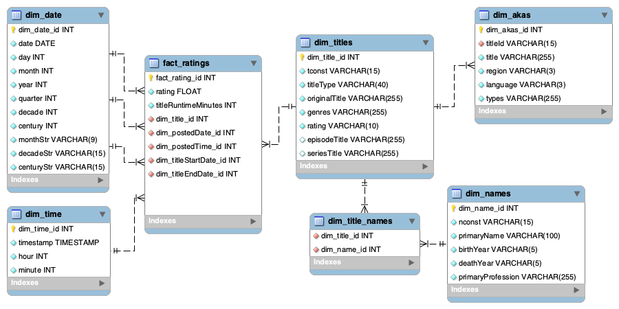

<!-- markdownlint-disable MD010 MD033 -->
# Spracovanie a analýza databázy filmov IMDb

## Popis projektu

Môj projekt sa zameriava na spracovanie [IMDb datasetu](https://developer.imdb.com/non-commercial-datasets/) pomocou ETL procesu v rámci hviezdicovej schémy na platforme [Snowflake](https://www.snowflake.com/).

## Zdrojový dataset

Platforma IMDb poskytuje časť svojich dát prostredníctvom datasetov pre verejnosť alebo akademické účely. Tieto dáta sa denne aktualizujú a najnovšia verzia je dostupná k stiahnutiu [**tu**](https://datasets.imdbws.com/).

V rámci môjho projektu analyzujem verziu datasetu k **6. decembru 2024** (veľkosť: ~1.6 GB).

**Entitno-relačný diagram datasetu** s vizualizáciou vzťahov naprieč všetkými súbormi v datasete by v tradičnej entitno-relačnej schéme vyzeral nasledovne:

<div align="center">

<p><b>Obrázok 1:</b> ERD diagram surových dát</p>
</div>

**Všeobecné vlastnosti datasetov:**

- Každý dataset je v komprimovanom formáte (gzip) a samotné dáta sú v TSV formáte (kde oddelovače hodnôt predstavujú tabulátory - `\t`);
- Kódovanie textu je UTF-8;
- Prvý riadok každého súboru obsahuje hlavičku so zoznamom stĺpcov;
- Hodnota `\N` predstavuje chýbajúcu alebo neznámu hodnotu (`NULL`);
- Polia (napr.: `types`, `attributes`) môžu obsahovať jeden alebo viac reťazcov, ktoré sú oddelené čiarkou;

### Súbory a ich význam

- `title.akas.tsv.gz`: obsahuje záznamy o alternatívnych, medzinárodných a lokálnych názvoch titulov, keďže názvy filmov sú obvykle prekladané do viacerých jazykov;
- `title.basics.tsv.gz`: obsahuje základné informácie o každom titule v datasete (titul môže predstavovať napr.: jeden film alebo seriál);
- `title.crew.tsv.gz`: informácie o filmových a televíznych tvorcoch, konkrétne o režiséroch (`directors`) a scenáristoch (`writers`);
- `title.episode.tsv.gz`: týka sa epizód seriálov; prepája epizódy (tituly) so seriálom, ktorého sú súčasťou (t. j. s nadradeným titulom);
- `title.principals.tsv.gz`: informácie o hlavných osobách spojených s titulom (herci, režiséri, kameramani, atď.), pričom uvádza ich roly alebo postavy, ktoré hrali;
- `title.ratings.tsv.gz`: obsahuje hodnotenia titulov na základe hlasovania používateľov IMDb;
- `name.basics.tsv.gz`: opisuje jednotlivé osoby (hercov, režisérov, scenáristov, atď.) v databáze;

## Staging

Úplne nazačiatku som vytvoril novú databázu a dátový sklad:

```sql
CREATE DATABASE IF NOT EXISTS HEDGEHOG_IMDB;
USE DATABASE HEDGEHOG_IMDB;

CREATE WAREHOUSE IF NOT EXISTS HEDGEHOG_IMDB_WH;
USE WAREHOUSE HEDGEHOG_IMDB_WH;
```

Nasleduje príkaz pre vytvorenie staging schémy:

```sql
CREATE SCHEMA IF NOT EXISTS HEDGEHOG_IMDB.staging;
```

Priečinok [`./extract`](./extract/) obsahuje 2 Bash skripty ktoré som vytvoril pre automatizáciu a zrýchlenie celého procesu:

1. [`stiahnut.sh`](./extract/stiahnut.sh) - stiahne všetky datasety zo stránky IMDb;
2. [`nahrat.sh`](./extract/nahrat.sh) - spustí SQL súbor [`nahrat.sql`](./extract/nahrat.sql), ktorý nahrá stiahnuté súbory pomocou príkazu `PUT` v [SnowSQL](https://docs.snowflake.com/en/user-guide/snowsql) na server Snowflake.

Hlavný dôvod prečo som použil SnowSQL rozhranie je ten, že štandardné webové rozhranie nepodporuje nahrávanie súborov väčších ako 250 MB - v taktom prípade je potrebné použiť práve príkaz `PUT`.

Avšak, najskôr je potrebné vytvoriť stage, do ktorej nahrám potrebné súbory:

```sql
CREATE OR REPLACE STAGE HEDGEHOG_IMDB.STAGING.IMDB_STAGE;
```

Počas tohto kroku som hneď vytvoril aj formát, ktorý popisuje moje TSV súbory. Teda, súbory obsahujú jeden riadok ktorý predstavuje hlavičku; hodnoty sú oddelené tabulátorom (čo predstavuje znak `\t`); jednotlivé záznamy sú oddelené novým riadkom (`\n`). Navyše, agument `NULL_IF` hovorí, že ak Snowflake pri spracovaní údajov narazí na pole s hodnotou `\N`, prekonvertuje to na pole s hodnotou `NULL`. Parameter `ERROR_ON_COLUMN_COUNT_MISMATCH` je užitočný, pokiaľ by údaje z nejakého dôvodu nemali konzistentný počet stĺpcov alebo by som urobil chybu a vynechal nejaký stĺpec v tabuľke:

```sql
CREATE OR REPLACE FILE FORMAT TSV_FORMAT
    TYPE = 'CSV'
    SKIP_HEADER = 1
    FIELD_DELIMITER = '\t' RECORD_DELIMITER = '\n'
    NULL_IF = ('\\N')
    ERROR_ON_COLUMN_COUNT_MISMATCH = TRUE;
```

Dáta sa v surovej podobe musia nahrať do staging arény vyhradenej pre dátový sklad môjho projektu (pomocou skriptu [`extract/nahrat.sh`](./extract/nahrat.sh)). Úspešnosť tohto kroku môžem následne overiť týmto SQL dotazom (alebo budem jednoducho sledovať výstup v termináli):

```sql
-- extract/nahrat.sh
LIST @HEDGEHOG_IMDB.STAGING.IMDB_STAGE/;
/*
name	                            size	    md5	                                last_modified
imdb_stage/title.principals.tsv.gz	693215888	46c6714c64061f82db048802cc754c87-83	Fri, 6 Dec 2024 18:41:11 GMT
imdb_stage/title.akas.tsv.gz	    438905200	ff6b9daa81caf8618cd45581e8624e22-53	Fri, 6 Dec 2024 18:08:54 GMT
imdb_stage/name.basics.tsv.gz	    276461856	72c1ac5d83f400ed350e58d7e4136872-33	Fri, 6 Dec 2024 19:08:53 GMT
imdb_stage/title.basics.tsv.gz	    198383712	9c73dce33351e5499f8d8d220a1028d0	Fri, 6 Dec 2024 18:26:55 GMT
imdb_stage/title.crew.tsv.gz	    73586400	4bbc9168a71b7e8a70c41731089dc216	Fri, 6 Dec 2024 18:35:54 GMT
imdb_stage/title.episode.tsv.gz	    47741904	614030ad20eaef6c4bcbb9a11b4a5125	Fri, 6 Dec 2024 18:39:24 GMT
imdb_stage/title.ratings.tsv.gz	    7583120	    883f2bb5e9ca543a35b4d220f8cb036c-2	Fri, 6 Dec 2024 17:45:16 GMT
*/
```

Pripravím si tabuľky, do ktorých budem kopírovať. Napr. toto je príkaz `CREATE TABLE` pre tabuľku `title_basics`:

```sql
CREATE OR REPLACE TABLE staging.title_basics (
    tconst VARCHAR(15) PRIMARY KEY,
    titleType VARCHAR(40),
    primaryTitle VARCHAR(255),
    originalTitle VARCHAR(255),
    isAdult BOOLEAN,
    startYear INTEGER,
    endYear INTEGER,
    runtimeMinutes INTEGER,
    genres VARCHAR(255)
);
```

V tomto bode používam `CREATE OR REPLACE`, pretože ak import zlyhá a v tabuľke zostanú z nejakého dôvodou údaje, nechcem tam mať duplicity pri opakovanom importe. Tento príkaz spôsobí to, že pri opätovnom spustení sa predošlá tabuľka nahradí (to jest, vymaže a znovu vytvorí nanovo).

Následne sa skopírujú do staging tabuliek, napr. pre tabuľku `title_basics` vyzerá príkaz `COPY INTO` nasledovne:

```sql
COPY INTO HEDGEHOG_IMDB.STAGING.title_basics
FROM @HEDGEHOG_IMDB.STAGING.IMDB_STAGE/title.basics.tsv.gz
FILE_FORMAT = TSV_FORMAT
ON_ERROR = 'CONTINUE';
/*
file	                         status	             rows_parsed rows_loaded error_limit errors_seen first_error	                                              first_error_line	first_error_character	first_error_column_name
imdb_stage/title.basics.tsv.gz	PARTIALLY_LOADED	11286007	11285932	11286007	75	        User character length limit (255) exceeded by string '... '	2613256	         18	                    "TITLE_BASICS"["PRIMARYTITLE":3]
*/
```

Z výstupu vyššie môžem vidieť, že sa úspešne načítalo 11 286 007 záznamov, ale vyskytlo sa aj 75 chýb pri konverzii údajov na formu ktorá zodpovedá schéme mojej Snowflake staging tabuľky.

Vyriešil som to príkazom `ON_ERROR = 'CONTINUE'`, čím zabezpečím to, že Snowflake bude v importovaní pokračovať aj vtedy, ak narazí na chybu. Napríklad, vyššie uvedený výstup hovorí, že Snowflake preskočil 75 záznamov. Je to z toho dôvodu, že tento riadok obsahoval pole, ktorého dĺžka presahovala veľkosť 255 (čo zodpovedá definícií pre `VARCHAR(255)` v mojej tabuľke).
Pomer takto "chybných" záznamov voči celkovému počtu je zanedbateľný a neskreslí moju analýzu žiadnym výrazným spôsobom. Taktiež sa chcem vyhnúť zbytočnému používaniu stĺpcov s typom `TEXT` - z toho dôvodou tieto hodnoty nebudem opravovať, iba ich import jednoducho preskočím.

Keďže predvolená možnosť pre parameter `COMPRESSION` v mojom `TSV_FORMAT` formáte je `'AUTO'`, Snowflake automaticky rozpozná že sa jedná o gzip súbory ktoré musí pred skopírovaním do tabulky dekomprimovať. Teda, nemusím nahrávať vopred dekomprimované dáta ktoré by zaberali oveľa viacej úložného priestoru.

## Hviezdicová schéma

Dáta som transformoval na hviezdicovú schému, ktorá je znázornená nižšie:

<div align="center">

<p><b>Obrázok 2:</b> ERD diagram hviezdicovej schémy</p>
</div>

## Odkazy

- [GitHub repozitár](https://github.com/SKevo18/imdb_projekt_dt_2024)
- [Zdrojové datasety](https://datasets.imdbws.com/)
- [Snowflake](https://www.snowflake.com/)
- ER diagramy boli vytvorené v programe [MySQLWorkbench](https://www.mysql.com/products/workbench/)

**Autor projektu:** Kevin Svitač, FPVaI UKF 2024
